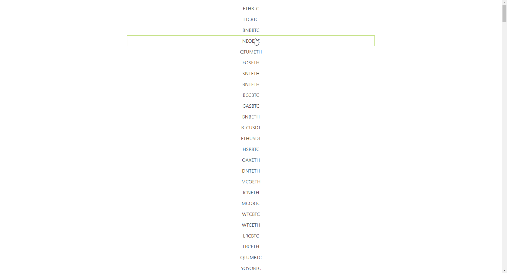

# Binance tickers using regular API

Display Binance tickers, order books, and trade history using regular endpoints.

## Stack

This project was bootstrapped with [Create React App](https://github.com/facebook/create-react-app).

[Redux](https://redux.js.org/) is used for global state management.

[Express](https://expressjs.com/fr/) is used to create a proxy server.

[Bulma](https://bulma.io/) is used for styling.

[Enzyme](https://github.com/airbnb/enzyme) is used for components testing.

## How to run ?

Binance API CORS don't allow to request endpoints from the browser. This is why there is a proxy server which broadcast calls to Binance API.

    npm install
    npm run server
    npm run start

Access to http://localhost:3000 to use the app.
